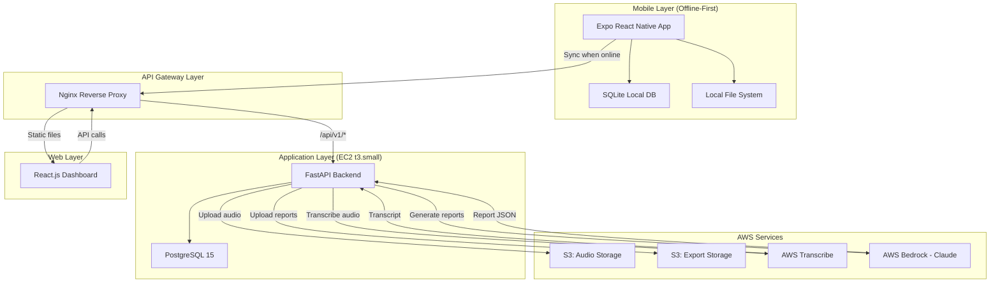
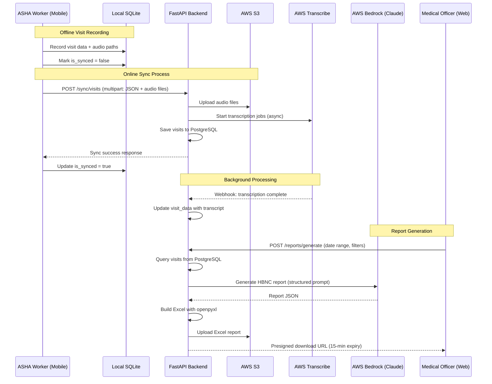

# Design Document: Voice of Care (ASHA)

## Overview

Voice of Care (ASHA) is an AWS Hackathon project addressing a critical healthcare challenge in rural India: ASHA workers are overburdened with manual paperwork for reporting health visits, causing payment delays of 2-3 months. This system replaces paper registers with an offline-first mobile application that captures voice and structured data during field visits, syncs to a cloud backend, and uses AI to generate government-compliant reports.

The solution consists of three integrated components: (1) an Expo-based React Native mobile app for ASHA workers to conduct and record HBNC visits offline, (2) a FastAPI backend hosted on AWS EC2 that processes data, manages storage, and orchestrates AI services, and (3) a React.js web dashboard for medical officers to monitor activities and export reports. The system leverages AWS Transcribe for speech-to-text conversion and AWS Bedrock (Claude 3.5 Sonnet) for intelligent report generation in government-compliant formats.

This v1 implementation focuses on HBNC (Home-Based Newborn Care) visits only, supporting English and Hindi languages on Android devices. The architecture prioritizes offline-first functionality with eventual consistency through a robust sync mechanism, ensuring ASHA workers can operate in areas with limited connectivity.

## Architecture

### System Architecture



### Data Flow Architecture



### Component Architecture

The system follows a three-tier architecture with clear separation of concerns:

**Mobile Tier (Offline-First)**
- Expo React Native application with local-first data persistence
- SQLite database for beneficiaries, templates, and visit records
- Local file system for audio recordings
- Zustand for state management
- expo-av for audio recording/playback
- expo-speech for text-to-speech
- react-i18next for English/Hindi localization

**Backend Tier (API + Services)**
- FastAPI application with async request handling
- SQLAlchemy ORM with Alembic migrations
- JWT-based authentication with bcrypt password hashing
- Service layer for AWS integrations (S3, Transcribe, Bedrock)
- PostgreSQL for persistent storage with JSONB for flexible schemas

**Web Tier (Admin Dashboard)**
- React.js SPA with Vite build system
- UX4G Design System (government standard)
- Recharts for data visualization
- Axios for API communication

## Components and Interfaces

### Mobile App Components

#### Authentication Module

**Purpose**: Handle worker authentication with two-factor approach (password + MPIN)

**Interface**:
```typescript
interface AuthService {
  login(workerId: string, password: string): Promise<AuthResponse>
  setupMPIN(mpin: string): Promise<void>
  verifyMPIN(mpin: string): Promise<AuthResponse>
  logout(): Promise<void>
  getStoredToken(): Promise<string | null>
}

interface AuthResponse {
  access_token: string
  token_type: string
  worker: WorkerProfile
}
```

**Responsibilities**:
- Authenticate workers using worker_id and password
- Manage MPIN setup and verification for subsequent logins
- Store JWT tokens securely using expo-secure-store
- Handle token refresh and expiration

#### Visit Recording Module

**Purpose**: Orchestrate the complete visit recording workflow from beneficiary selection to data persistence

**Interface**:
```typescript
interface VisitRecordingService {
  startVisit(visitType: 'hbnc' | 'anc' | 'pnc'): Promise<void>
  verifyBeneficiary(mctsId: string): Promise<Beneficiary>
  selectDay(dayNumber: number): Promise<VisitTemplate>
  recordAnswer(questionId: string, answer: Answer): Promise<void>
  recordVoice(questionId: string): Promise<AudioRecording>
  saveVisit(visitData: VisitData): Promise<number>
}

interface Answer {
  questionId: string
  answerType: 'yes_no' | 'number' | 'voice'
  value: string | number | null
  audioPath?: string
  recordedAt: string
}

interface AudioRecording {
  uri: string
  duration: number
  size: number
}
```

**Responsibilities**:
- Manage visit workflow state across multiple screens
- Validate beneficiary MCTS IDs against local SQLite
- Load appropriate question templates based on visit type and day
- Record and persist answers immediately to prevent data loss
- Handle audio recording with expo-av
- Save complete visit data to SQLite with is_synced flag

#### Sync Module

**Purpose**: Synchronize local visit data with backend when connectivity is available

**Interface**:
```typescript
interface SyncService {
  syncAllPending(): Promise<SyncResult>
  syncVisit(visitId: number): Promise<boolean>
  getPendingSyncCount(): Promise<number>
  getLastSyncTime(): Promise<Date | null>
}

interface SyncResult {
  success: boolean
  syncedCount: number
  failedCount: number
  errors: SyncError[]
}

interface SyncError {
  visitId: number
  message: string
}
```

**Responsibilities**:
- Query SQLite for visits where is_synced = false
- Build multipart FormData with visit JSON and audio files
- Upload to backend /sync/visits endpoint
- Update local SQLite records on successful sync
- Handle partial sync failures gracefully
- Provide sync status feedback to UI

#### Local Database Module

**Purpose**: Manage SQLite database operations for offline data persistence

**Interface**:
```typescript
interface DatabaseService {
  initialize(): Promise<void>
  seedFromServer(data: InitData): Promise<void>
  
  // Workers
  getWorker(id: number): Promise<Worker | null>
  
  // Beneficiaries
  getBeneficiaries(ashaId: number): Promise<Beneficiary[]>
  getBeneficiaryByMCTS(mctsId: string): Promise<Beneficiary | null>
  
  // Templates
  getTemplate(type: string): Promise<VisitTemplate | null>
  
  // Visits
  createVisit(visit: VisitCreate): Promise<number>
  getVisits(filters: VisitFilters): Promise<Visit[]>
  updateVisitSyncStatus(visitId: number, serverId: number): Promise<void>
  getPendingVisits(): Promise<Visit[]>
}

interface InitData {
  worker: Worker
  beneficiaries: Beneficiary[]
  templates: VisitTemplate[]
}
```

**Responsibilities**:
- Initialize SQLite database with schema on first launch
- Seed reference data from /mobile/init endpoint
- Provide CRUD operations for all entities
- Maintain data integrity with foreign key constraints
- Handle JSON serialization for JSONB-like fields

### Backend API Components

#### Authentication Service

**Purpose**: Manage worker authentication, JWT generation, and MPIN handling

**Interface**:
```python
class AuthService:
    def authenticate_worker(self, worker_id: str, password: str) -> TokenResponse
    def setup_mpin(self, worker_id: int, mpin: str) -> bool
    def verify_mpin(self, worker_id: int, mpin: str) -> TokenResponse
    def create_access_token(self, data: dict, expires_delta: timedelta) -> str
    def verify_token(self, token: str) -> dict

class TokenResponse(BaseModel):
    access_token: str
    token_type: str
    worker: WorkerProfile
```

**Responsibilities**:
- Validate worker credentials against database
- Hash and verify passwords using bcrypt
- Generate JWT tokens with configurable expiration
- Store and verify 4-digit MPIN hashes
- Provide middleware for protected route authentication

#### Sync Service

**Purpose**: Process bulk visit uploads from mobile devices

**Interface**:
```python
class SyncService:
    def process_visit_sync(
        self, 
        visits: List[VisitCreate], 
        audio_files: Dict[str, UploadFile],
        worker_id: int
    ) -> SyncResponse
    
    def upload_audio_to_s3(self, file: UploadFile, s3_key: str) -> str
    def start_transcription(self, s3_key: str, language: str) -> str
    def create_sync_log(self, log_data: SyncLogCreate) -> SyncLog

class SyncResponse(BaseModel):
    success: bool
    synced_visit_ids: List[int]
    failed_visits: List[dict]
```

**Responsibilities**:
- Parse multipart form data with visit JSON and audio files
- Upload audio files to S3 with organized key structure
- Trigger AWS Transcribe jobs for each audio file
- Save visit records to PostgreSQL with is_synced = true
- Create sync_log entries for audit trail
- Handle partial failures gracefully

#### Report Generation Service

**Purpose**: Generate government-compliant Excel reports using Claude AI

**Interface**:
```python
class ReportService:
    def generate_report(
        self, 
        visit_type: str,
        start_date: date,
        end_date: date,
        worker_id: Optional[int] = None
    ) -> ReportResponse
    
    def query_visits(self, filters: ReportFilters) -> List[Visit]
    def format_for_claude(self, visits: List[Visit]) -> str
    def invoke_bedrock(self, prompt: str) -> dict
    def build_excel(self, data: dict) -> bytes
    def upload_report_to_s3(self, file_bytes: bytes, filename: str) -> str
    def generate_presigned_url(self, s3_key: str, expiration: int = 900) -> str

class ReportResponse(BaseModel):
    report_id: str
    download_url: str
    expires_at: datetime
```

**Responsibilities**:
- Query visits from database based on filters
- Format visit data into structured prompt for Claude
- Invoke AWS Bedrock with Claude 3.5 Sonnet model
- Parse Claude's JSON response
- Build Excel workbook using openpyxl
- Upload report to S3 and generate presigned download URL

#### AWS Integration Services

**S3 Service**:
```python
class S3Service:
    def upload_file(self, file: bytes, bucket: str, key: str) -> str
    def generate_presigned_url(self, bucket: str, key: str, expiration: int) -> str
    def delete_file(self, bucket: str, key: str) -> bool
```

**Transcribe Service**:
```python
class TranscribeService:
    def start_transcription_job(
        self, 
        job_name: str,
        s3_uri: str,
        language_code: str
    ) -> str
    def get_transcription_result(self, job_name: str) -> Optional[str]
```

**Bedrock Service**:
```python
class BedrockService:
    def invoke_claude(self, prompt: str, max_tokens: int = 4096) -> dict
    def format_hbnc_report_prompt(self, visits_data: List[dict]) -> str
```

### Web Dashboard Components

#### DataTable Component

**Purpose**: Reusable paginated table with search, filter, and export capabilities

**Interface**:
```typescript
interface DataTableProps<T> {
  columns: Column<T>[]
  data: T[]
  totalCount: number
  currentPage: number
  pageSize: number
  onPageChange: (page: number) => void
  onSearch: (query: string) => void
  onFilter: (filters: Record<string, any>) => void
  onExport: () => void
  onRowClick: (row: T) => void
  loading?: boolean
}

interface Column<T> {
  key: keyof T
  label: string
  sortable?: boolean
  render?: (value: any, row: T) => React.ReactNode
}
```

**Responsibilities**:
- Render paginated data with UX4G styling
- Handle search input with debouncing
- Manage filter state and UI
- Trigger export actions
- Emit row click events for detail views

#### DetailModal Component

**Purpose**: Display detailed entity information in a modal overlay

**Interface**:
```typescript
interface DetailModalProps {
  title: string
  fields: Field[]
  isOpen: boolean
  onClose: () => void
}

interface Field {
  label: string
  value: any
  type?: 'text' | 'date' | 'json' | 'badge' | 'audio'
  render?: (value: any) => React.ReactNode
}
```

**Responsibilities**:
- Render modal with UX4G modal component
- Display field-value pairs with appropriate formatting
- Handle JSON rendering for visit_data fields
- Support audio playback for recorded answers

## Data Models

### Worker Model

```python
class Worker(Base):
    __tablename__ = "workers"
    
    id: int = Column(Integer, primary_key=True)
    first_name: str = Column(String, nullable=False)
    last_name: str = Column(String, nullable=False)
    phone_number: str = Column(String, nullable=False)
    aadhar_id: str = Column(String, unique=True)
    email: str = Column(String, unique=True)
    address: str = Column(Text)
    worker_type: str = Column(String, nullable=False)  # asha_worker, medical_officer, anm, aaw
    worker_id: str = Column(String(8), unique=True, nullable=False)
    password_hash: str = Column(Text, nullable=False)
    mpin_hash: str = Column(Text)
    collection_center_id: int = Column(Integer, ForeignKey("collection_centers.id"))
    profile_photo_url: str = Column(Text)
    meta_data: dict = Column(JSONB, default={})
    created_at: datetime = Column(DateTime, default=datetime.utcnow)
    updated_at: datetime = Column(DateTime, default=datetime.utcnow, onupdate=datetime.utcnow)
```

**Validation Rules**:
- worker_id must be exactly 8 digits, system-generated
- worker_type must be one of: asha_worker, medical_officer, anm, aaw
- phone_number must match Indian mobile format (10 digits)
- aadhar_id must be 12 digits if provided
- email must be valid email format if provided
- password must be at least 8 characters
- mpin must be exactly 4 digits

### Beneficiary Model

```python
class Beneficiary(Base):
    __tablename__ = "beneficiaries"
    
    id: int = Column(Integer, primary_key=True)
    first_name: str = Column(String, nullable=False)
    last_name: str = Column(String, nullable=False)
    phone_number: str = Column(String)
    aadhar_id: str = Column(String)
    email: str = Column(String)
    address: str = Column(Text)
    age: int = Column(Integer)
    weight: float = Column(Numeric(5, 2))
    mcts_id: str = Column(String, unique=True)
    beneficiary_type: str = Column(String, nullable=False)  # individual, child, mother_child
    assigned_asha_id: int = Column(Integer, ForeignKey("workers.id"))
    meta_data: dict = Column(JSONB, default={})
    created_at: datetime = Column(DateTime, default=datetime.utcnow)
    updated_at: datetime = Column(DateTime, default=datetime.utcnow, onupdate=datetime.utcnow)
```

**Validation Rules**:
- mcts_id must be unique and non-empty for HBNC beneficiaries
- beneficiary_type must be one of: individual, child, mother_child
- age must be positive integer if provided
- weight must be positive decimal if provided
- assigned_asha_id must reference valid worker with type asha_worker

### Visit Model

```python
class Visit(Base):
    __tablename__ = "visits"
    
    id: int = Column(Integer, primary_key=True)
    visit_type: str = Column(String, nullable=False)  # hbnc, anc, pnc
    visit_date_time: datetime = Column(DateTime, nullable=False)
    day_number: int = Column(Integer)  # HBNC: 1, 3, 7, 14, 28
    is_synced: bool = Column(Boolean, default=False)
    assigned_asha_id: int = Column(Integer, ForeignKey("workers.id"))
    beneficiary_id: int = Column(Integer, ForeignKey("beneficiaries.id"))
    template_id: int = Column(Integer, ForeignKey("visit_templates.id"))
    visit_data: dict = Column(JSONB, nullable=False)
    meta_data: dict = Column(JSONB, default={})
    synced_at: datetime = Column(DateTime)
    created_at: datetime = Column(DateTime, default=datetime.utcnow)
    updated_at: datetime = Column(DateTime, default=datetime.utcnow, onupdate=datetime.utcnow)
```

**visit_data JSONB Structure**:
```json
{
  "answers": [
    {
      "question_id": "hbnc_q1",
      "answer": "yes",
      "audio_s3_key": "audio/worker_1/visit_123/q1.m4a",
      "transcript_en": "yes the baby is breathing fine",
      "transcript_hi": null,
      "recorded_at": "2026-03-01T10:30:00Z"
    }
  ]
}
```

**Validation Rules**:
- visit_type must be one of: hbnc, anc, pnc
- day_number required for HBNC visits, must be one of: 1, 3, 7, 14, 28
- visit_data.answers must be non-empty array
- Each answer must have question_id matching template
- assigned_asha_id must reference worker with type asha_worker
- beneficiary_id must reference valid beneficiary
- template_id must reference template matching visit_type

### Visit Template Model

```python
class VisitTemplate(Base):
    __tablename__ = "visit_templates"
    
    id: int = Column(Integer, primary_key=True)
    template_type: str = Column(String, nullable=False)  # hbnc, anc, pnc
    name: str = Column(String, nullable=False)
    questions: list = Column(JSONB, nullable=False)
    meta_data: dict = Column(JSONB, default={})
    created_at: datetime = Column(DateTime, default=datetime.utcnow)
```

**questions JSONB Structure**:
```json
[
  {
    "id": "hbnc_q1",
    "order": 1,
    "input_type": "yes_no",
    "question_en": "Is the baby breathing normally?",
    "question_hi": "क्या बच्चा सामान्य रूप से सांस ले रहा है?",
    "action_en": "If no, refer to nearest health facility immediately.",
    "action_hi": "यदि नहीं, तुरंत निकटतम अस्पताल जाएं।",
    "is_required": true
  }
]
```

**Validation Rules**:
- template_type must be one of: hbnc, anc, pnc
- questions array must be non-empty
- Each question must have unique id within template
- input_type must be one of: yes_no, number, voice
- Both question_en and question_hi must be provided
- order must be sequential starting from 1

### Sync Log Model

```python
class SyncLog(Base):
    __tablename__ = "sync_logs"
    
    id: int = Column(Integer, primary_key=True)
    visit_id: int = Column(Integer, ForeignKey("visits.id"))
    worker_id: int = Column(Integer, ForeignKey("workers.id"))
    collection_center_id: int = Column(Integer, ForeignKey("collection_centers.id"))
    date_time: datetime = Column(DateTime, default=datetime.utcnow)
    status: str = Column(String, nullable=False)  # completed, incomplete, failed
    error_message: str = Column(Text)
    meta_data: dict = Column(JSONB, default={})
```

**Validation Rules**:
- status must be one of: completed, incomplete, failed
- error_message required when status is failed
- visit_id must reference valid visit
- worker_id must reference valid worker

## Algorithmic Pseudocode

### Main Visit Recording Algorithm

```pascal
ALGORITHM recordVisitWorkflow(visitType, mctsId, dayNumber)
INPUT: visitType (string), mctsId (string), dayNumber (integer)
OUTPUT: visitId (integer) or error

BEGIN
  ASSERT visitType IN ['hbnc', 'anc', 'pnc']
  ASSERT dayNumber IN [1, 3, 7, 14, 28] IF visitType = 'hbnc'
  
  // Step 1: Verify beneficiary
  beneficiary ← queryLocalDB("SELECT * FROM beneficiaries WHERE mcts_id = ?", mctsId)
  IF beneficiary IS NULL THEN
    RETURN Error("Beneficiary not found. Please sync or contact admin.")
  END IF
  
  // Step 2: Load template
  template ← queryLocalDB("SELECT * FROM templates WHERE template_type = ?", visitType)
  ASSERT template IS NOT NULL
  questions ← parseJSON(template.questions)
  
  // Step 3: Initialize visit data structure
  visitData ← {
    answers: [],
    beneficiary_id: beneficiary.id,
    visit_type: visitType,
    day_number: dayNumber,
    visit_date_time: getCurrentTimestamp()
  }
  
  // Step 4: Iterate through questions
  FOR each question IN questions DO
    ASSERT allPreviousAnswersRecorded(visitData.answers, question.order - 1)
    
    // Display question with TTS
    displayQuestion(question)
    playTextToSpeech(question.question_en OR question.question_hi)
    
    // Collect answer based on input type
    answer ← NULL
    IF question.input_type = 'yes_no' THEN
      answer ← waitForYesNoInput()
    ELSE IF question.input_type = 'number' THEN
      answer ← waitForNumericInput()
    ELSE IF question.input_type = 'voice' THEN
      audioPath ← recordAudio(question.id)
      answer ← {
        type: 'voice',
        audio_path: audioPath,
        duration: getAudioDuration(audioPath)
      }
    END IF
    
    // Persist answer immediately
    answerRecord ← {
      question_id: question.id,
      answer: answer,
      recorded_at: getCurrentTimestamp()
    }
    visitData.answers.append(answerRecord)
    saveToLocalDB(visitData)
    
    // Display action/suggestion if applicable
    IF question.action_en IS NOT NULL THEN
      displayActionCard(question.action_en OR question.action_hi)
    END IF
  END FOR
  
  // Step 5: Save complete visit
  visitId ← insertLocalDB(
    "INSERT INTO visits (visit_type, day_number, beneficiary_id, template_id, visit_data, is_synced) VALUES (?, ?, ?, ?, ?, 0)",
    visitType, dayNumber, beneficiary.id, template.id, JSON.stringify(visitData)
  )
  
  ASSERT visitId > 0
  RETURN visitId
END
```

**Preconditions**:
- User is authenticated with valid JWT
- SQLite database is initialized and seeded
- Beneficiary with given MCTS ID exists in local database
- Template for visit type exists in local database
- Device has sufficient storage for audio recordings

**Postconditions**:
- Visit record created in local SQLite with is_synced = false
- All answers persisted with timestamps
- Audio files saved to local file system
- visitId returned for reference

**Loop Invariants**:
- All answers up to current question are persisted in SQLite
- visitData.answers array length equals current question order
- All audio files referenced in answers exist in file system

### Sync Algorithm

```pascal
ALGORITHM syncPendingVisits()
INPUT: none (uses authenticated worker context)
OUTPUT: syncResult (success count, failed count, errors)

BEGIN
  ASSERT hasInternetConnection() = true
  ASSERT hasValidJWT() = true
  
  // Step 1: Query pending visits
  pendingVisits ← queryLocalDB("SELECT * FROM visits WHERE is_synced = 0")
  
  IF pendingVisits.length = 0 THEN
    RETURN {success: true, syncedCount: 0, failedCount: 0, errors: []}
  END IF
  
  // Step 2: Prepare multipart form data
  formData ← createMultipartFormData()
  visitsArray ← []
  audioFiles ← []
  
  FOR each visit IN pendingVisits DO
    visitData ← parseJSON(visit.visit_data)
    
    // Collect audio files
    FOR each answer IN visitData.answers DO
      IF answer.audio_path IS NOT NULL THEN
        audioFile ← readFileFromDisk(answer.audio_path)
        audioKey ← "audio_" + visit.id + "_" + answer.question_id
        audioFiles.append({key: audioKey, file: audioFile})
        
        // Update path to expected S3 key
        answer.audio_s3_key ← "audio/worker_" + workerId + "/visit_" + visit.id + "/" + answer.question_id + ".m4a"
        DELETE answer.audio_path
      END IF
    END FOR
    
    visitsArray.append({
      local_id: visit.id,
      visit_type: visit.visit_type,
      day_number: visit.day_number,
      visit_date_time: visit.visit_date_time,
      beneficiary_id: visit.beneficiary_id,
      template_id: visit.template_id,
      visit_data: visitData
    })
  END FOR
  
  formData.append("visits_json", JSON.stringify(visitsArray))
  FOR each audioFile IN audioFiles DO
    formData.append(audioFile.key, audioFile.file)
  END FOR
  
  // Step 3: Upload to backend
  TRY
    response ← httpPost("/api/v1/sync/visits", formData, {
      headers: {"Authorization": "Bearer " + getJWT()},
      timeout: 300000  // 5 minutes
    })
    
    IF response.status = 200 THEN
      syncedVisitIds ← response.data.synced_visit_ids
      
      // Step 4: Update local database
      FOR each visitId IN syncedVisitIds DO
        serverId ← response.data.visit_mapping[visitId]
        updateLocalDB(
          "UPDATE visits SET is_synced = 1, server_id = ? WHERE id = ?",
          serverId, visitId
        )
      END FOR
      
      RETURN {
        success: true,
        syncedCount: syncedVisitIds.length,
        failedCount: 0,
        errors: []
      }
    ELSE
      RETURN {
        success: false,
        syncedCount: 0,
        failedCount: pendingVisits.length,
        errors: [{message: "Server returned status " + response.status}]
      }
    END IF
  CATCH error
    RETURN {
      success: false,
      syncedCount: 0,
      failedCount: pendingVisits.length,
      errors: [{message: error.message}]
    }
  END TRY
END
```

**Preconditions**:
- Device has active internet connection
- Valid JWT token stored in secure storage
- At least one visit with is_synced = false exists
- All audio files referenced in visit_data exist on disk

**Postconditions**:
- All successfully synced visits have is_synced = true
- server_id populated for synced visits
- Audio files uploaded to S3
- Sync log created on backend
- Failed visits remain with is_synced = false for retry

**Loop Invariants**:
- All processed visits have corresponding entries in visitsArray
- All audio files referenced in visitsArray are included in audioFiles
- No duplicate audio file keys in formData

### Report Generation Algorithm

```pascal
ALGORITHM generateHBNCReport(startDate, endDate, workerId)
INPUT: startDate (date), endDate (date), workerId (integer, optional)
OUTPUT: reportDownloadUrl (string) or error

BEGIN
  ASSERT startDate <= endDate
  ASSERT endDate <= getCurrentDate()
  
  // Step 1: Query visits from database
  query ← "SELECT v.*, b.first_name, b.last_name, b.mcts_id, w.first_name as asha_first_name, w.last_name as asha_last_name 
           FROM visits v 
           JOIN beneficiaries b ON v.beneficiary_id = b.id 
           JOIN workers w ON v.assigned_asha_id = w.id 
           WHERE v.visit_type = 'hbnc' 
           AND v.visit_date_time BETWEEN ? AND ? 
           AND v.is_synced = true"
  
  IF workerId IS NOT NULL THEN
    query ← query + " AND v.assigned_asha_id = ?"
    visits ← executeQuery(query, startDate, endDate, workerId)
  ELSE
    visits ← executeQuery(query, startDate, endDate)
  END IF
  
  IF visits.length = 0 THEN
    RETURN Error("No visits found for the specified criteria")
  END IF
  
  // Step 2: Format data for Claude
  visitsData ← []
  FOR each visit IN visits DO
    visitData ← parseJSON(visit.visit_data)
    formattedVisit ← {
      beneficiary_name: visit.first_name + " " + visit.last_name,
      mcts_id: visit.mcts_id,
      asha_name: visit.asha_first_name + " " + visit.asha_last_name,
      visit_date: formatDate(visit.visit_date_time),
      day_number: visit.day_number,
      answers: []
    }
    
    FOR each answer IN visitData.answers DO
      formattedVisit.answers.append({
        question_id: answer.question_id,
        answer: answer.answer,
        transcript: answer.transcript_en OR answer.transcript_hi
      })
    END FOR
    
    visitsData.append(formattedVisit)
  END FOR
  
  // Step 3: Construct Claude prompt
  prompt ← "You are a healthcare data analyst. Given the following HBNC visit data, generate a structured summary in the format of an HBNC government register.
  
  Visit Data:
  " + JSON.stringify(visitsData, indent=2) + "
  
  Generate a JSON response with the following structure:
  {
    \"report_title\": \"HBNC Visit Report\",
    \"period\": \"" + formatDate(startDate) + " to " + formatDate(endDate) + "\",
    \"total_visits\": <count>,
    \"visits\": [
      {
        \"serial_no\": <number>,
        \"beneficiary_name\": <string>,
        \"mcts_id\": <string>,
        \"asha_worker\": <string>,
        \"visit_date\": <string>,
        \"day_number\": <number>,
        \"breathing_normal\": <yes/no>,
        \"feeding_well\": <yes/no>,
        \"temperature_normal\": <yes/no>,
        \"remarks\": <string>
      }
    ]
  }
  
  Extract the relevant information from the answers array and map to the appropriate columns."
  
  // Step 4: Invoke Bedrock
  TRY
    claudeResponse ← invokeBedrockClaude(prompt, maxTokens=4096)
    reportData ← parseJSON(claudeResponse.content)
  CATCH error
    RETURN Error("Failed to generate report: " + error.message)
  END TRY
  
  // Step 5: Build Excel workbook
  workbook ← createExcelWorkbook()
  worksheet ← workbook.addWorksheet("HBNC Report")
  
  // Add headers
  headers ← ["S.No", "Beneficiary Name", "MCTS ID", "ASHA Worker", "Visit Date", "Day", "Breathing", "Feeding", "Temperature", "Remarks"]
  worksheet.appendRow(headers)
  
  // Add data rows
  FOR each visit IN reportData.visits DO
    row ← [
      visit.serial_no,
      visit.beneficiary_name,
      visit.mcts_id,
      visit.asha_worker,
      visit.visit_date,
      visit.day_number,
      visit.breathing_normal,
      visit.feeding_well,
      visit.temperature_normal,
      visit.remarks
    ]
    worksheet.appendRow(row)
  END FOR
  
  // Step 6: Save and upload to S3
  excelBytes ← workbook.saveToBytes()
  filename ← "hbnc_report_" + formatDate(getCurrentDate()) + "_" + generateUUID() + ".xlsx"
  s3Key ← "reports/" + filename
  
  uploadToS3(excelBytes, S3_EXPORTS_BUCKET, s3Key)
  
  // Step 7: Generate presigned URL
  downloadUrl ← generatePresignedUrl(S3_EXPORTS_BUCKET, s3Key, expiration=900)
  
  RETURN {
    report_id: generateUUID(),
    download_url: downloadUrl,
    expires_at: getCurrentTimestamp() + 900
  }
END
```

**Preconditions**:
- startDate and endDate are valid dates
- At least one synced HBNC visit exists in the date range
- AWS Bedrock access is configured with Claude model
- S3 exports bucket exists and is accessible
- openpyxl library is available

**Postconditions**:
- Excel report generated with all visit data
- Report uploaded to S3 with unique filename
- Presigned URL generated with 15-minute expiration
- Report data formatted according to government standards

**Loop Invariants**:
- All processed visits have complete answer data
- Excel row count equals visits count + 1 (header)
- All S3 keys are unique

## Key Functions with Formal Specifications

### Function: authenticateWorker()

```python
def authenticate_worker(worker_id: str, password: str) -> TokenResponse:
    """Authenticate worker and generate JWT token"""
    pass
```

**Preconditions**:
- worker_id is non-empty string
- password is non-empty string
- Database connection is active

**Postconditions**:
- If credentials valid: returns TokenResponse with valid JWT
- If credentials invalid: raises HTTPException with 401 status
- No side effects on database (read-only operation)
- JWT token contains worker_id, worker_type, and expiration

**Loop Invariants**: N/A (no loops)

### Function: setupMPIN()

```python
def setup_mpin(worker_id: int, mpin: str) -> bool:
    """Set 4-digit MPIN for worker after first login"""
    pass
```

**Preconditions**:
- worker_id references existing worker in database
- mpin is exactly 4 digits (validated by caller)
- Worker's mpin_hash is currently NULL
- Request is authenticated with valid JWT

**Postconditions**:
- Worker's mpin_hash updated with bcrypt hash of mpin
- Returns true on success
- Raises HTTPException if worker not found or MPIN already set
- MPIN stored as irreversible hash (bcrypt)

**Loop Invariants**: N/A (no loops)

### Function: processVisitSync()

```python
def process_visit_sync(
    visits: List[VisitCreate], 
    audio_files: Dict[str, UploadFile],
    worker_id: int
) -> SyncResponse:
    """Process bulk visit sync from mobile device"""
    pass
```

**Preconditions**:
- visits is non-empty list of valid VisitCreate objects
- audio_files dict keys match audio references in visit_data
- worker_id references authenticated worker
- All referenced beneficiaries and templates exist in database
- S3 bucket is accessible

**Postconditions**:
- All valid visits saved to database with is_synced = true
- All audio files uploaded to S3 with keys: audio/{worker_id}/{visit_id}/{question_id}.m4a
- Transcription jobs started for all audio files (async)
- Sync log created with status 'completed' or 'incomplete'
- Returns SyncResponse with synced_visit_ids and any failures
- Partial success possible: some visits may fail while others succeed

**Loop Invariants**:
- For each processed visit: corresponding audio files are uploaded before database insert
- All successfully uploaded audio files have S3 keys stored in visit_data
- Sync log entries created for all processed visits

### Function: recordAudio()

```typescript
async function recordAudio(questionId: string): Promise<string>
```

**Preconditions**:
- Device has microphone permission granted
- expo-av library is initialized
- Sufficient storage space available (at least 10MB)
- questionId is valid and unique within current visit

**Postconditions**:
- Audio file saved to local file system
- File path returned in format: {documentDirectory}audio/visit_{visitId}/q_{questionId}.m4a
- Audio format: m4a, 64kbps, mono
- Maximum duration: 60 seconds (enforced by UI)
- File exists and is readable

**Loop Invariants**: N/A (no loops)

### Function: seedLocalDatabase()

```typescript
async function seedLocalDatabase(initData: InitData): Promise<void>
```

**Preconditions**:
- SQLite database is initialized with schema
- initData contains valid worker, beneficiaries, and templates
- No existing data in local tables (first-time seed)
- Device has sufficient storage

**Postconditions**:
- Worker record inserted into local workers table
- All beneficiaries inserted into local beneficiaries table
- All templates inserted into local templates table
- Foreign key relationships maintained
- Returns void on success, throws error on failure

**Loop Invariants**:
- For beneficiaries loop: all previously inserted beneficiaries have valid assigned_asha_id
- For templates loop: all previously inserted templates have valid JSON in questions field

## Example Usage

### Mobile App: Complete Visit Flow

```typescript
// 1. Authentication
const authService = new AuthService()
const authResponse = await authService.login("12345678", "password123")
await SecureStore.setItemAsync("jwt_token", authResponse.access_token)

// 2. First-time MPIN setup
await authService.setupMPIN("1234")

// 3. Initialize local database
const apiClient = new ApiClient(authResponse.access_token)
const initData = await apiClient.getMobileInit()
const dbService = new DatabaseService()
await dbService.seedFromServer(initData)

// 4. Start HBNC visit
const visitService = new VisitRecordingService(dbService)
await visitService.startVisit("hbnc")

// 5. Verify beneficiary
const beneficiary = await visitService.verifyBeneficiary("MCTS123456")
console.log(`Recording visit for: ${beneficiary.first_name} ${beneficiary.last_name}`)

// 6. Select day
const template = await visitService.selectDay(3) // Day 3 visit

// 7. Record answers
for (const question of template.questions) {
  // Play question via TTS
  await Speech.speak(question.question_en)
  
  if (question.input_type === "yes_no") {
    const answer = await getUserYesNoInput()
    await visitService.recordAnswer(question.id, {
      questionId: question.id,
      answerType: "yes_no",
      value: answer,
      recordedAt: new Date().toISOString()
    })
  } else if (question.input_type === "voice") {
    const recording = await visitService.recordVoice(question.id)
    await visitService.recordAnswer(question.id, {
      questionId: question.id,
      answerType: "voice",
      value: null,
      audioPath: recording.uri,
      recordedAt: new Date().toISOString()
    })
  }
}

// 8. Save visit
const visitId = await visitService.saveVisit({
  visitType: "hbnc",
  dayNumber: 3,
  beneficiaryId: beneficiary.id,
  templateId: template.id,
  answers: visitService.getCurrentAnswers()
})

console.log(`Visit saved with ID: ${visitId}`)

// 9. Later: Sync when online
const syncService = new SyncService(apiClient, dbService)
const syncResult = await syncService.syncAllPending()
console.log(`Synced ${syncResult.syncedCount} visits`)
```

### Backend: Process Sync Request

```python
from fastapi import FastAPI, UploadFile, File, Form, Depends
from typing import List, Dict

app = FastAPI()

@app.post("/api/v1/sync/visits")
async def sync_visits(
    visits_json: str = Form(...),
    audio_files: List[UploadFile] = File(...),
    current_worker: Worker = Depends(get_current_worker)
):
    # Parse visits
    visits_data = json.loads(visits_json)
    
    # Initialize services
    sync_service = SyncService(db_session, s3_service, transcribe_service)
    
    # Process sync
    result = await sync_service.process_visit_sync(
        visits=visits_data,
        audio_files={f.filename: f for f in audio_files},
        worker_id=current_worker.id
    )
    
    return result
```

### Web Dashboard: Generate Report

```typescript
// Report generation flow
const handleGenerateReport = async () => {
  const filters = {
    visit_type: "hbnc",
    start_date: "2026-03-01",
    end_date: "2026-03-31",
    worker_id: selectedWorkerId
  }
  
  try {
    const response = await apiClient.post("/api/v1/reports/generate", filters)
    const { download_url, expires_at } = response.data
    
    // Show download button
    setReportUrl(download_url)
    setExpiresAt(new Date(expires_at))
    
    toast.success("Report generated successfully!")
  } catch (error) {
    toast.error("Failed to generate report: " + error.message)
  }
}

// Download report
const handleDownload = () => {
  window.open(reportUrl, "_blank")
}
```

## Correctness Properties

### Universal Quantification Statements

**P1: Visit Data Integrity**
```
∀ visit ∈ Visits: visit.is_synced = true ⟹ 
  (∃ sync_log ∈ SyncLogs: sync_log.visit_id = visit.id ∧ sync_log.status = 'completed')
```
All synced visits must have a corresponding successful sync log entry.

**P2: Audio File Consistency**
```
∀ visit ∈ Visits, ∀ answer ∈ visit.visit_data.answers:
  answer.audio_s3_key ≠ null ⟹ 
  (∃ file ∈ S3Bucket: file.key = answer.audio_s3_key ∧ file.exists = true)
```
All audio S3 keys referenced in visit data must correspond to existing files in S3.

**P3: Beneficiary Assignment**
```
∀ visit ∈ Visits:
  visit.assigned_asha_id ∈ Workers ∧ 
  Workers[visit.assigned_asha_id].worker_type = 'asha_worker' ∧
  visit.beneficiary_id ∈ Beneficiaries ∧
  Beneficiaries[visit.beneficiary_id].assigned_asha_id = visit.assigned_asha_id
```
All visits must be assigned to ASHA workers, and the beneficiary must be assigned to the same ASHA worker.

**P4: Template Question Completeness**
```
∀ visit ∈ Visits:
  let template = Templates[visit.template_id]
  let required_questions = {q ∈ template.questions | q.is_required = true}
  ⟹ ∀ q ∈ required_questions: 
    (∃ answer ∈ visit.visit_data.answers: answer.question_id = q.id)
```
All required questions in a template must have corresponding answers in the visit data.

**P5: HBNC Day Sequence**
```
∀ beneficiary ∈ Beneficiaries:
  let hbnc_visits = {v ∈ Visits | v.beneficiary_id = beneficiary.id ∧ v.visit_type = 'hbnc'}
  ⟹ ∀ v1, v2 ∈ hbnc_visits: 
    v1.day_number < v2.day_number ⟹ v1.visit_date_time < v2.visit_date_time
```
HBNC visits for a beneficiary must occur in chronological order matching day numbers.

**P6: Authentication Token Validity**
```
∀ request ∈ ProtectedEndpoints:
  request.headers['Authorization'] = 'Bearer ' + token ⟹
  (∃ worker ∈ Workers: decode(token).worker_id = worker.id ∧ token.exp > now())
```
All requests to protected endpoints must include a valid, non-expired JWT token.

**P7: Sync Idempotency**
```
∀ visit ∈ Visits:
  let sync_count = |{s ∈ SyncLogs | s.visit_id = visit.id ∧ s.status = 'completed'}|
  ⟹ sync_count ≤ 1
```
Each visit should be successfully synced at most once (no duplicate syncs).

**P8: Report Data Freshness**
```
∀ report ∈ GeneratedReports:
  let visits_in_report = {v ∈ Visits | v.id ∈ report.visit_ids}
  ⟹ ∀ v ∈ visits_in_report: v.is_synced = true
```
Reports can only include visits that have been synced to the backend.

## Error Handling

### Error Scenario 1: Network Failure During Sync

**Condition**: Mobile device loses internet connection during sync upload

**Response**: 
- Catch network timeout exception
- Rollback any partial database updates
- Keep visits marked as is_synced = false
- Display user-friendly error message: "Sync failed due to network issue. Your data is safe and will sync when connection is restored."

**Recovery**:
- User can retry sync manually via "Sync All Pending" button
- System automatically retries on next app launch if network available
- No data loss occurs; all visits remain in local SQLite

### Error Scenario 2: Invalid MCTS ID

**Condition**: ASHA worker enters MCTS ID that doesn't exist in local database

**Response**:
- Query local SQLite returns null
- Display error message: "Beneficiary not found. Please sync your data or contact your supervisor."
- Prevent navigation to next screen
- Offer "Sync Now" button to fetch latest beneficiary data

**Recovery**:
- User triggers sync to download latest beneficiaries
- User re-enters MCTS ID after sync
- If still not found, user contacts supervisor to add beneficiary via web dashboard

### Error Scenario 3: Audio Recording Permission Denied

**Condition**: User denies microphone permission when attempting voice recording

**Response**:
- expo-av throws permission error
- Catch error and display modal: "Microphone access is required to record voice answers. Please enable it in Settings."
- Provide "Open Settings" button that deep-links to app settings
- Disable voice recording UI until permission granted

**Recovery**:
- User grants permission in device settings
- Returns to app and retries recording
- If permission permanently denied, suggest using yes/no or number input types instead

### Error Scenario 4: AWS Bedrock Rate Limit

**Condition**: Too many report generation requests exceed Bedrock quota

**Response**:
- Bedrock API returns 429 ThrottlingException
- Backend catches exception and logs error
- Return HTTP 503 with message: "Report generation service is temporarily busy. Please try again in a few minutes."
- Create failed sync log entry

**Recovery**:
- Implement exponential backoff retry logic (3 attempts)
- If all retries fail, queue request for later processing
- Notify user via email when report is ready
- Consider requesting quota increase from AWS

### Error Scenario 5: Corrupted Audio File

**Condition**: Audio file on device is corrupted or unreadable during sync

**Response**:
- File read operation throws error
- Skip corrupted file and continue with other files
- Mark visit as partially synced
- Log error with visit ID and question ID
- Include in sync result errors array

**Recovery**:
- Display warning to user: "Some audio files could not be uploaded. Visit data saved without audio."
- Allow user to re-record affected answers
- Provide option to sync again with corrected files

### Error Scenario 6: Database Migration Failure

**Condition**: Alembic migration fails during backend deployment

**Response**:
- Migration script catches exception
- Rollback transaction to previous state
- Log detailed error with stack trace
- Prevent application startup
- Send alert to development team

**Recovery**:
- Review migration script for errors
- Fix SQL syntax or constraint issues
- Test migration on staging database
- Re-deploy with corrected migration
- If data corruption occurred, restore from backup

## Testing Strategy

### Unit Testing Approach

**Backend (Python/FastAPI)**:
- Use pytest with pytest-asyncio for async tests
- Mock external dependencies (S3, Transcribe, Bedrock) using unittest.mock
- Test each service method in isolation
- Aim for 80%+ code coverage

Key test cases:
- Authentication: valid credentials, invalid credentials, expired tokens
- MPIN: setup, verification, duplicate setup prevention
- Visit sync: single visit, bulk visits, partial failures
- Report generation: valid data, empty results, Claude API failures
- Database operations: CRUD operations, constraint violations

**Mobile (TypeScript/React Native)**:
- Use Jest with React Native Testing Library
- Mock expo modules (expo-av, expo-sqlite, expo-secure-store)
- Test component rendering and user interactions
- Test service layer logic independently

Key test cases:
- Authentication flow: login, MPIN setup, MPIN verification
- Visit recording: question navigation, answer persistence, audio recording
- Sync service: pending visits query, FormData construction, error handling
- Database service: CRUD operations, seeding, queries

**Web (TypeScript/React)**:
- Use Vitest with React Testing Library
- Mock API calls using MSW (Mock Service Worker)
- Test component rendering and state management
- Test form validation and submission

Key test cases:
- Login/signup forms: validation, submission, error handling
- Data tables: pagination, search, filtering, sorting
- Report generation: form submission, download link display
- Detail modals: data rendering, JSON formatting

### Property-Based Testing Approach

**Property Test Library**: fast-check (JavaScript/TypeScript), Hypothesis (Python)

**Property 1: Visit Data Serialization**
```typescript
// Property: Any visit data can be serialized to JSON and deserialized without loss
fc.assert(
  fc.property(visitDataArbitrary, (visitData) => {
    const serialized = JSON.stringify(visitData)
    const deserialized = JSON.parse(serialized)
    expect(deserialized).toEqual(visitData)
  })
)
```

**Property 2: MPIN Hash Uniqueness**
```python
# Property: Different MPINs produce different hashes
@given(st.text(min_size=4, max_size=4, alphabet=st.characters(whitelist_categories=('Nd',))))
def test_mpin_hash_uniqueness(mpin1, mpin2):
    assume(mpin1 != mpin2)
    hash1 = bcrypt.hashpw(mpin1.encode(), bcrypt.gensalt())
    hash2 = bcrypt.hashpw(mpin2.encode(), bcrypt.gensalt())
    assert hash1 != hash2
```

**Property 3: Sync Idempotency**
```typescript
// Property: Syncing the same visit multiple times produces same result
fc.assert(
  fc.property(visitArbitrary, async (visit) => {
    const result1 = await syncService.syncVisit(visit.id)
    const result2 = await syncService.syncVisit(visit.id)
    expect(result1).toEqual(result2)
    expect(await dbService.getPendingVisits()).toHaveLength(0)
  })
)
```

**Property 4: Audio File Path Validity**
```typescript
// Property: All generated audio file paths are valid and unique
fc.assert(
  fc.property(fc.array(questionIdArbitrary), (questionIds) => {
    const paths = questionIds.map(qId => generateAudioPath(visitId, qId))
    const uniquePaths = new Set(paths)
    expect(uniquePaths.size).toBe(paths.length)
    paths.forEach(path => {
      expect(path).toMatch(/^.*\/audio\/visit_\d+\/q_[\w]+\.m4a$/)
    })
  })
)
```

### Integration Testing Approach

**Backend Integration Tests**:
- Use TestClient from FastAPI
- Spin up test PostgreSQL database (Docker container)
- Use localstack for S3/Transcribe/Bedrock mocking
- Test complete API workflows end-to-end

Key integration tests:
- Complete authentication flow: login → MPIN setup → protected endpoint access
- Visit sync flow: upload visits → verify database → check S3 files
- Report generation flow: query visits → invoke Bedrock → generate Excel → upload S3

**Mobile Integration Tests**:
- Use Detox for E2E testing on Android emulator
- Test complete user journeys
- Verify SQLite persistence across app restarts

Key integration tests:
- First-time user flow: login → MPIN setup → database seeding → dashboard
- Complete visit flow: start visit → verify MCTS → select day → record answers → save
- Sync flow: record offline visit → go online → sync → verify success

**Web Integration Tests**:
- Use Playwright for E2E browser testing
- Mock backend API with MSW
- Test complete user workflows

Key integration tests:
- Login → dashboard → view workers → add worker
- Login → visits → view details → generate report → download
- Login → data export → select filters → generate → download

## Performance Considerations

**Mobile App**:
- SQLite queries optimized with indexes on mcts_id, is_synced, beneficiary_id
- Audio files compressed to 64kbps to reduce storage and upload time
- Lazy loading for past visits list (paginated queries)
- Debounced search inputs to reduce query frequency
- Image caching for profile photos

**Backend API**:
- Database connection pooling (SQLAlchemy default: 5-10 connections)
- Async request handling with FastAPI for concurrent requests
- Pagination for all list endpoints (default: 20 items per page)
- Database indexes on frequently queried columns (worker_id, mcts_id, visit_date_time, is_synced)
- S3 multipart upload for large audio files (>5MB)
- Background task queue for transcription processing (consider Celery for production)

**AWS Services**:
- S3 lifecycle policy to archive old audio files to Glacier after 90 days
- CloudFront CDN for web dashboard static assets (future optimization)
- Transcribe batch processing to reduce API calls
- Bedrock request caching for identical report queries (Redis cache)

**Database**:
- JSONB indexes on visit_data for faster queries: `CREATE INDEX idx_visit_data_answers ON visits USING GIN (visit_data);`
- Partitioning visits table by month for large datasets (future optimization)
- Regular VACUUM and ANALYZE operations
- Read replicas for reporting queries (future scaling)

## Security Considerations

**Authentication & Authorization**:
- Passwords hashed with bcrypt (cost factor: 12)
- MPINs hashed with bcrypt (cost factor: 10 for faster mobile verification)
- JWT tokens with 24-hour expiration
- Refresh token mechanism (future enhancement)
- Role-based access control: ASHA workers can only access their assigned beneficiaries
- Medical officers can view all data but cannot modify visits

**Data Protection**:
- HTTPS/TLS for all API communication (Nginx with Let's Encrypt)
- JWT tokens stored in expo-secure-store (encrypted keychain on Android)
- S3 buckets private by default, presigned URLs for temporary access
- Database credentials stored in environment variables, never in code
- Audio files encrypted at rest in S3 (AES-256)
- PII (Aadhar, phone numbers) encrypted in database (future enhancement)

**Input Validation**:
- Pydantic schemas validate all API inputs
- SQL injection prevention via SQLAlchemy parameterized queries
- File upload validation: max size 10MB, allowed types: m4a, mp3
- MCTS ID format validation (alphanumeric, 10-12 characters)
- Worker ID format validation (exactly 8 digits)

**API Security**:
- Rate limiting: 100 requests per minute per IP (Nginx limit_req)
- CORS configured to allow only web dashboard origin
- Request size limits: 50MB for sync endpoint, 1MB for others
- SQL injection, XSS, CSRF protection via FastAPI security features

**Audit Trail**:
- All sync operations logged in sync_logs table
- Failed authentication attempts logged
- Report generation logged with user ID and timestamp
- Database triggers for audit trail on sensitive tables (future enhancement)

## Dependencies

**Mobile App (Expo)**:
- expo: ^50.0.0
- expo-av: ^14.0.0 (audio recording/playback)
- expo-sqlite: ^14.0.0 (local database)
- expo-secure-store: ^13.0.0 (secure token storage)
- expo-speech: ^12.0.0 (text-to-speech)
- @react-navigation/native: ^6.1.0 (navigation)
- @react-navigation/stack: ^6.3.0
- @react-navigation/bottom-tabs: ^6.5.0
- zustand: ^4.5.0 (state management)
- axios: ^1.6.0 (HTTP client)
- react-i18next: ^14.0.0 (internationalization)
- i18next: ^23.7.0

**Backend (FastAPI)**:
- fastapi: ^0.109.0
- uvicorn: ^0.27.0 (ASGI server)
- sqlalchemy: ^2.0.0 (ORM)
- alembic: ^1.13.0 (migrations)
- psycopg2-binary: ^2.9.0 (PostgreSQL driver)
- python-jose: ^3.3.0 (JWT)
- passlib: ^1.7.0 (password hashing)
- bcrypt: ^4.1.0
- boto3: ^1.34.0 (AWS SDK)
- openpyxl: ^3.1.0 (Excel generation)
- python-multipart: ^0.0.6 (file uploads)
- pydantic: ^2.5.0 (validation)
- pydantic-settings: ^2.1.0 (config management)

**Web Dashboard (React)**:
- react: ^18.2.0
- react-dom: ^18.2.0
- vite: ^5.0.0 (build tool)
- react-router-dom: ^6.21.0 (routing)
- axios: ^1.6.0 (HTTP client)
- recharts: ^2.10.0 (charts)
- UX4G Design System: 2.0.8 (CDN)

**AWS Services**:
- AWS EC2: t3.small instance (2 vCPU, 2GB RAM)
- AWS S3: Two buckets (audio, exports)
- AWS Transcribe: hi-IN and en-IN language models
- AWS Bedrock: Claude 3.5 Sonnet (anthropic.claude-3-5-sonnet-20241022-v2:0)
- IAM: Instance profile with S3, Transcribe, Bedrock permissions

**Infrastructure**:
- Docker: ^24.0.0
- docker-compose: ^2.23.0
- Nginx: ^1.25.0 (reverse proxy)
- PostgreSQL: ^15.0
- Ubuntu: 22.04 LTS (EC2 host OS)

**Development Tools**:
- Git: Version control
- GitHub: Repository hosting
- Postman: API testing
- Android Studio: Mobile app testing
- VS Code: Code editor
