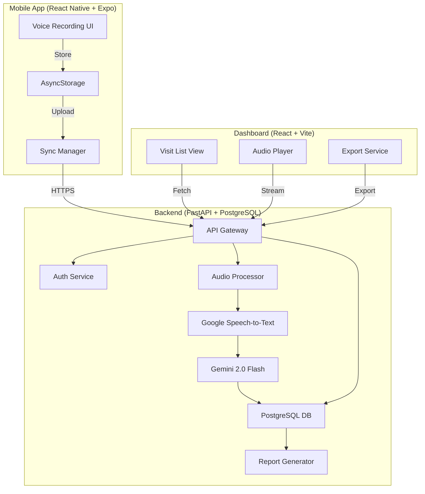

# Design Document: Voice of Care

## Overview

Voice of Care is a three-tier system consisting of a React Native mobile app, FastAPI backend, and React dashboard. The architecture prioritizes offline-first operation, efficient audio processing, and government-compliant data formatting. The mobile app captures voice recordings through a guided Q&A interface, stores data locally using AsyncStorage, and syncs to the backend when connectivity is available. The backend processes audio using Google Speech-to-Text and Gemini 2.0 Flash for data extraction, then stores structured data in PostgreSQL. The dashboard provides visualization, filtering, and export capabilities for health administrators.

## Architecture

### System Components



### Data Flow

1. **Recording Phase**: ASHA worker records answers to 5 guided questions → Audio stored in AsyncStorage with metadata
2. **Sync Phase**: When online, Sync Manager uploads audio files + metadata to Backend API
3. **Processing Phase**: Backend transcribes audio → Gemini extracts structured data → Stored in PostgreSQL
4. **Reporting Phase**: Dashboard fetches visit data → Displays/filters/exports to CSV

### Technology Stack

**Mobile App:**
- React Native 0.72+ with Expo SDK 49+
- expo-av for audio recording
- @react-native-async-storage/async-storage for offline persistence
- axios for HTTP requests with retry logic
- React Navigation for screen management

**Backend:**
- FastAPI 0.104+ (Python 3.11+)
- PostgreSQL 15+ for data storage
- SQLAlchemy 2.0+ for ORM
- Google Cloud Speech-to-Text API v1
- Google Gemini 2.0 Flash API
- JWT for authentication
- Pydantic for data validation

**Dashboard:**
- React 18+ with Vite 5+
- TanStack Query (React Query) for data fetching
- Tailwind CSS for styling
- Recharts for future analytics (P2)
- react-audio-player for playback

## Components and Interfaces

### Mobile App Components

#### VoiceRecorder Component
```typescript
interface VoiceRecorderProps {
  questionNumber: number;
  questionText: string;
  onRecordingComplete: (audioUri: string, duration: number) => void;
}

interface Recording {
  uri: string;
  duration: number;
  size: number;
}

// Handles push-to-talk recording
// - Uses expo-av Audio.Recording API
// - Configures audio mode: { allowsRecordingIOS: true, playsInSilentModeIOS: true }
// - Recording settings: { android: { extension: '.m4a', outputFormat: MPEG_4, audioEncoder: AAC, sampleRate: 16000, numberOfChannels: 1, bitRate: 64000 }, ios: { extension: '.m4a', audioQuality: MEDIUM, sampleRate: 16000, numberOfChannels: 1, bitRate: 64000 } }
// - Implements press-and-hold gesture for recording
// - Shows visual feedback during recording (waveform animation)
```

#### GuidedQuestionFlow Component
```typescript
interface Question {
  id: number;
  text: string;
  hindiText: string;
}

interface VisitSession {
  visitId: string;
  patientId: string;
  timestamp: string;
  recordings: Recording[];
  currentQuestion: number;
}

// Manages 5-question flow
// - Displays current question with progress (e.g., "2 of 5")
// - Allows navigation back to previous questions
// - Marks visit complete when all 5 answered
// - Persists state to AsyncStorage after each recording
```

#### OfflineStorage Service
```typescript
interface StoredVisit {
  visitId: string;
  patientId: string;
  ashaWorkerId: string;
  timestamp: string;
  recordings: Array<{
    questionId: number;
    audioUri: string;
    duration: number;
    size: number;
  }>;
  syncStatus: 'pending' | 'syncing' | 'synced' | 'failed';
  syncAttempts: number;
  lastSyncAttempt?: string;
}

class OfflineStorageService {
  async saveVisit(visit: StoredVisit): Promise<void>
  async getVisit(visitId: string): Promise<StoredVisit | null>
  async getAllPendingVisits(): Promise<StoredVisit[]>
  async updateSyncStatus(visitId: string, status: string): Promise<void>
  async getStorageUsage(): Promise<{ used: number; available: number }>
}

// Uses AsyncStorage with keys: `visit:${visitId}`
// Audio files stored in FileSystem.documentDirectory
// Implements atomic writes to prevent corruption
```

#### SyncManager Service
```typescript
interface SyncResult {
  visitId: string;
  success: boolean;
  error?: string;
}

class SyncManager {
  async syncVisit(visit: StoredVisit): Promise<SyncResult>
  async syncAllPending(): Promise<SyncResult[]>
  private async uploadAudioFile(uri: string): Promise<string>
  private async retryWithBackoff(fn: () => Promise<any>, maxAttempts: number): Promise<any>
}

// Monitors network connectivity using NetInfo
// Uploads audio files as multipart/form-data
// Implements exponential backoff: delays of 1s, 2s, 4s
// Retries up to 3 times before marking as failed
```

### Backend Components

#### API Endpoints
```python
from fastapi import FastAPI, UploadFile, Depends
from pydantic import BaseModel

class VisitUpload(BaseModel):
    visit_id: str
    patient_id: str
    asha_worker_id: str
    timestamp: str
    question_id: int

class VisitData(BaseModel):
    visit_id: str
    patient_id: str
    asha_worker_id: str
    timestamp: str
    transcriptions: list[str]
    extracted_data: dict
    sync_status: str

# POST /api/v1/visits/upload
# - Accepts multipart form with audio file + metadata
# - Validates authentication token
# - Stores audio in cloud storage (S3/GCS)
# - Queues for processing
# - Returns visit_id

# GET /api/v1/visits
# - Query params: asha_worker_id, date_from, date_to, sync_status
# - Returns paginated list of visits
# - Supports filtering and sorting

# GET /api/v1/visits/{visit_id}
# - Returns full visit data including transcriptions and extracted fields
# - Includes signed URL for audio playback

# GET /api/v1/visits/export
# - Query params: same as GET /visits
# - Returns CSV file with filtered visits
# - Streams response for large datasets
```

#### AudioProcessor Service
```python
from google.cloud import speech_v1
from google.generativeai import GenerativeModel

class AudioProcessor:
    def __init__(self):
        self.speech_client = speech_v1.SpeechClient()
        self.gemini_model = GenerativeModel('gemini-2.0-flash')
    
    async def transcribe_audio(self, audio_uri: str, language_code: str = 'hi-IN') -> str:
        """
        Transcribes audio using Google Speech-to-Text
        - Configures for Hindi with English fallback
        - Uses enhanced model for better accuracy
        - Enables automatic punctuation
        """
        config = speech_v1.RecognitionConfig(
            encoding=speech_v1.RecognitionConfig.AudioEncoding.MP4,
            sample_rate_hertz=16000,
            language_code=language_code,
            alternative_language_codes=['en-IN'],
            enable_automatic_punctuation=True,
            model='latest_long',
        )
        # Implementation details...
    
    async def extract_health_data(self, transcription: str) -> dict:
        """
        Extracts structured data using Gemini 2.0 Flash
        - Prompts for specific fields: BP, temperature, vaccinations, symptoms
        - Returns JSON with extracted values
        - Handles missing/unclear data gracefully
        """
        prompt = f"""
        Extract health data from this patient visit transcription.
        Return JSON with these fields:
        - blood_pressure: {{ systolic: number, diastolic: number }} or null
        - temperature: number (in Celsius) or null
        - vaccinations: array of strings or []
        - symptoms: array of strings or []
        - medications: array of strings or []
        - notes: string
        
        Transcription: {transcription}
        """
        # Implementation details...
```

#### Database Schema
```sql
-- Users table (ASHA workers and dashboard users)
CREATE TABLE users (
    id UUID PRIMARY KEY DEFAULT gen_random_uuid(),
    username VARCHAR(100) UNIQUE NOT NULL,
    password_hash VARCHAR(255) NOT NULL,
    role VARCHAR(50) NOT NULL, -- 'asha_worker', 'bmo', 'admin'
    full_name VARCHAR(200),
    phone_number VARCHAR(15),
    created_at TIMESTAMP DEFAULT CURRENT_TIMESTAMP
);

-- Visits table
CREATE TABLE visits (
    id UUID PRIMARY KEY DEFAULT gen_random_uuid(),
    visit_id VARCHAR(100) UNIQUE NOT NULL, -- from mobile app
    patient_id VARCHAR(100) NOT NULL,
    asha_worker_id UUID REFERENCES users(id),
    visit_timestamp TIMESTAMP NOT NULL,
    created_at TIMESTAMP DEFAULT CURRENT_TIMESTAMP,
    sync_status VARCHAR(50) DEFAULT 'pending', -- 'pending', 'processing', 'completed', 'failed'
    processing_error TEXT
);

-- Audio recordings table
CREATE TABLE recordings (
    id UUID PRIMARY KEY DEFAULT gen_random_uuid(),
    visit_id UUID REFERENCES visits(id),
    question_id INTEGER NOT NULL,
    audio_url TEXT NOT NULL, -- S3/GCS URL
    duration_seconds INTEGER,
    file_size_bytes INTEGER,
    transcription TEXT,
    transcription_confidence FLOAT,
    created_at TIMESTAMP DEFAULT CURRENT_TIMESTAMP
);

-- Extracted health data table
CREATE TABLE health_data (
    id UUID PRIMARY KEY DEFAULT gen_random_uuid(),
    visit_id UUID REFERENCES visits(id),
    blood_pressure_systolic INTEGER,
    blood_pressure_diastolic INTEGER,
    temperature_celsius FLOAT,
    vaccinations JSONB, -- array of vaccination names
    symptoms JSONB, -- array of symptoms
    medications JSONB, -- array of medications
    notes TEXT,
    extraction_confidence FLOAT,
    created_at TIMESTAMP DEFAULT CURRENT_TIMESTAMP
);

-- Indexes for performance
CREATE INDEX idx_visits_asha_worker ON visits(asha_worker_id);
CREATE INDEX idx_visits_timestamp ON visits(visit_timestamp);
CREATE INDEX idx_visits_sync_status ON visits(sync_status);
CREATE INDEX idx_recordings_visit ON recordings(visit_id);
CREATE INDEX idx_health_data_visit ON health_data(visit_id);
```

#### ReportGenerator Service
```python
import csv
from io import StringIO
from datetime import datetime

class ReportGenerator:
    def generate_csv(self, visits: list[dict]) -> str:
        """
        Generates CSV report from visit data
        - Columns: Visit ID, Patient ID, ASHA Worker, Date, Time, BP Systolic, BP Diastolic, Temperature, Vaccinations, Symptoms, Medications, Notes
        - Formats dates as DD/MM/YYYY
        - Flattens JSONB arrays to comma-separated strings
        """
        output = StringIO()
        writer = csv.DictWriter(output, fieldnames=[
            'Visit ID', 'Patient ID', 'ASHA Worker', 'Date', 'Time',
            'BP Systolic', 'BP Diastolic', 'Temperature (°C)',
            'Vaccinations', 'Symptoms', 'Medications', 'Notes'
        ])
        writer.writeheader()
        # Implementation details...
        return output.getvalue()
    
    def generate_jsy_format(self, visits: list[dict]) -> str:
        """
        Generates JSY (Janani Suraksha Yojana) format report
        - P1 feature - not in MVP
        """
        pass
```

### Dashboard Components

#### VisitListView Component
```typescript
interface Visit {
  visitId: string;
  patientId: string;
  ashaWorkerName: string;
  timestamp: string;
  syncStatus: 'pending' | 'processing' | 'completed' | 'failed';
}

interface VisitFilters {
  dateFrom?: string;
  dateTo?: string;
  ashaWorkerId?: string;
  syncStatus?: string;
}

// Displays paginated table of visits
// - Uses TanStack Query for data fetching with caching
// - Implements filter controls (date range, ASHA worker, status)
// - Shows 50 visits per page with pagination controls
// - Click row to view details
```

#### VisitDetailView Component
```typescript
interface VisitDetail {
  visitId: string;
  patientId: string;
  ashaWorkerName: string;
  timestamp: string;
  recordings: Array<{
    questionId: number;
    questionText: string;
    audioUrl: string;
    transcription: string;
    duration: number;
  }>;
  healthData: {
    bloodPressure?: { systolic: number; diastolic: number };
    temperature?: number;
    vaccinations: string[];
    symptoms: string[];
    medications: string[];
    notes: string;
  };
}

// Displays full visit details
// - Shows all 5 questions with transcriptions
// - Provides audio playback for each recording
// - Displays extracted health data in structured format
// - Highlights missing or low-confidence extractions
```

#### AudioPlayer Component
```typescript
interface AudioPlayerProps {
  audioUrl: string;
  duration: number;
}

// Plays audio recordings
// - Uses react-audio-player library
// - Shows playback controls (play/pause, seek, speed)
// - Displays waveform visualization (P1 feature)
// - Lazy-loads audio only when player is mounted
```

#### ExportService
```typescript
class ExportService {
  async exportToCSV(filters: VisitFilters): Promise<void> {
    // Calls backend /api/v1/visits/export endpoint
    // Triggers browser download of CSV file
    // Shows loading indicator during export
    // Handles errors gracefully
  }
  
  async exportToExcel(filters: VisitFilters): Promise<void> {
    // P1 feature - not in MVP
  }
}
```

## Data Models

### Mobile App Models

```typescript
// Visit model stored in AsyncStorage
interface Visit {
  visitId: string; // UUID generated on device
  patientId: string; // entered by ASHA worker
  ashaWorkerId: string; // from auth token
  timestamp: string; // ISO 8601 format
  recordings: Recording[];
  syncStatus: 'pending' | 'syncing' | 'synced' | 'failed';
  syncAttempts: number;
  lastSyncAttempt?: string;
}

// Recording model
interface Recording {
  questionId: number; // 1-5
  audioUri: string; // file:// path on device
  duration: number; // seconds
  size: number; // bytes
}

// Guided questions (hardcoded in app)
const GUIDED_QUESTIONS: Question[] = [
  { id: 1, text: "What is the patient's name and age?", hindiText: "मरीज का नाम और उम्र क्या है?" },
  { id: 2, text: "What are the patient's symptoms?", hindiText: "मरीज के लक्षण क्या हैं?" },
  { id: 3, text: "What is the blood pressure and temperature?", hindiText: "रक्तचाप और तापमान क्या है?" },
  { id: 4, text: "What vaccinations were given?", hindiText: "कौन से टीके दिए गए?" },
  { id: 5, text: "Any additional notes or medications?", hindiText: "कोई अतिरिक्त नोट्स या दवाएं?" }
];
```

### Backend Models

```python
from pydantic import BaseModel, Field
from datetime import datetime
from typing import Optional
from uuid import UUID

class User(BaseModel):
    id: UUID
    username: str
    role: str
    full_name: Optional[str]
    phone_number: Optional[str]

class VisitCreate(BaseModel):
    visit_id: str
    patient_id: str
    asha_worker_id: UUID
    visit_timestamp: datetime

class Recording(BaseModel):
    id: UUID
    visit_id: UUID
    question_id: int
    audio_url: str
    duration_seconds: int
    file_size_bytes: int
    transcription: Optional[str]
    transcription_confidence: Optional[float]

class HealthData(BaseModel):
    blood_pressure_systolic: Optional[int] = Field(None, ge=60, le=250)
    blood_pressure_diastolic: Optional[int] = Field(None, ge=40, le=150)
    temperature_celsius: Optional[float] = Field(None, ge=35.0, le=42.0)
    vaccinations: list[str] = []
    symptoms: list[str] = []
    medications: list[str] = []
    notes: str = ""
    extraction_confidence: Optional[float] = Field(None, ge=0.0, le=1.0)

class VisitDetail(BaseModel):
    id: UUID
    visit_id: str
    patient_id: str
    asha_worker: User
    visit_timestamp: datetime
    sync_status: str
    recordings: list[Recording]
    health_data: Optional[HealthData]
    created_at: datetime
```

## Correctness Properties

*A property is a characteristic or behavior that should hold true across all valid executions of a system—essentially, a formal statement about what the system should do. Properties serve as the bridge between human-readable specifications and machine-verifiable correctness guarantees.*


### Property 1: Recording triggers audio capture
*For any* button press event on the record button, the Mobile_App should transition to recording state and begin capturing audio.
**Validates: Requirements 1.1**

### Property 2: Recording release saves audio
*For any* button release event during recording, the Mobile_App should stop capturing audio and persist the recording to Offline_Storage.
**Validates: Requirements 1.2**

### Property 3: Five questions per visit
*For any* patient visit session, the Mobile_App should display exactly 5 guided questions.
**Validates: Requirements 1.3, 10.2**

### Property 4: Recording completion advances question
*For any* completed recording, the Mobile_App should automatically increment the current question number.
**Validates: Requirements 1.4, 10.3**

### Property 5: Immediate recording persistence
*For any* captured voice recording, the Mobile_App should store it in Offline_Storage before allowing the next action.
**Validates: Requirements 1.5**

### Property 6: Audio capture error recovery
*For any* audio capture failure, the Mobile_App should display an error message and allow the user to retry the recording.
**Validates: Requirements 1.6**

### Property 7: Offline recording persistence
*For any* voice recording captured without network connectivity, the Mobile_App should successfully persist it to Offline_Storage.
**Validates: Requirements 2.1**

### Property 8: Metadata persistence with recordings
*For any* patient visit, the Mobile_App should store all metadata (patient ID, timestamp, ASHA worker ID) alongside voice recordings in Offline_Storage.
**Validates: Requirements 2.2, 13.4**

### Property 9: Data persistence round-trip
*For any* visit data stored in Offline_Storage, closing and reopening the Mobile_App should restore the exact same visit data.
**Validates: Requirements 2.3**

### Property 10: Data integrity until sync
*For any* stored visit, the data should remain unchanged and uncorrupted until successful sync completion.
**Validates: Requirements 2.5**

### Property 11: Automatic sync on connectivity
*For any* unsynced visit when network connectivity becomes available, the Mobile_App should initiate a Sync_Operation.
**Validates: Requirements 3.1**

### Property 12: Sync completion updates status
*For any* successful Sync_Operation, the Mobile_App should mark the visit as synced and retain the local copy.
**Validates: Requirements 3.2**

### Property 13: Sync retry with exponential backoff
*For any* failed Sync_Operation, the Mobile_App should retry up to 3 times with exponential backoff delays (1s, 2s, 4s).
**Validates: Requirements 3.3**

### Property 14: Sync status visibility
*For any* visit, the Mobile_App should display its current sync status (pending, in-progress, completed, failed).
**Validates: Requirements 3.4**

### Property 15: Chronological sync order
*For any* set of multiple pending visits, the Mobile_App should upload them in chronological order by timestamp.
**Validates: Requirements 3.5**

### Property 16: Manual sync trigger
*For any* refresh action by the user, the Mobile_App should initiate a Sync_Operation for pending visits.
**Validates: Requirements 3.6**

### Property 17: Audio transcription invocation
*For any* voice recording received by the Backend_System, it should invoke Google Speech-to-Text API for transcription.
**Validates: Requirements 4.1**

### Property 18: Data extraction after transcription
*For any* completed transcription, the Backend_System should invoke Gemini 2.0 Flash to extract structured Visit_Data.
**Validates: Requirements 4.2**

### Property 19: Health data extraction completeness
*For any* transcription containing health data mentions (blood pressure, temperature, vaccinations), the Backend_System should extract all mentioned data types into structured fields.
**Validates: Requirements 4.3, 4.4, 4.5**

### Property 20: Transcription and data persistence
*For any* processed visit, the Backend_System should store both the transcription and extracted Visit_Data in PostgreSQL.
**Validates: Requirements 4.6**

### Property 21: Transcription failure handling
*For any* transcription failure, the Backend_System should log the error and mark the visit as requiring manual review.
**Validates: Requirements 4.7**

### Property 22: Multilingual audio processing
*For any* audio containing Hindi, English, or mixed Hindi-English speech, the Backend_System should successfully process and transcribe it.
**Validates: Requirements 5.3**

### Property 23: Low confidence flagging
*For any* transcription with language detection confidence below threshold, the Backend_System should flag it for manual review.
**Validates: Requirements 5.4**

### Property 24: CSV report generation
*For any* extracted Visit_Data, the Backend_System should generate a Government_Report in CSV format.
**Validates: Requirements 6.1**

### Property 25: Report field completeness
*For any* generated Government_Report, it should include all required fields for government submission.
**Validates: Requirements 6.2**

### Property 26: Date format compliance
*For any* date in a Government_Report, it should be formatted as DD/MM/YYYY.
**Validates: Requirements 6.3**

### Property 27: Mandatory field validation
*For any* report generation attempt, the Backend_System should validate that all mandatory fields are present before generating the report.
**Validates: Requirements 6.4**

### Property 28: Incomplete report marking
*For any* report generation attempt with missing mandatory fields, the Backend_System should mark the report as incomplete.
**Validates: Requirements 6.5**

### Property 29: Visit list display completeness
*For any* visit displayed in the Dashboard list, it should include timestamp, ASHA worker name, and sync status.
**Validates: Requirements 7.1**

### Property 30: Visit detail navigation
*For any* visit clicked in the Dashboard, the full Visit_Data including all extracted fields should be displayed.
**Validates: Requirements 7.2**

### Property 31: Audio playback availability
*For any* voice recording in a visit, the Dashboard should provide audio playback capability.
**Validates: Requirements 7.3**

### Property 32: Transcription display
*For any* visit detail view, the Dashboard should display transcriptions alongside extracted Visit_Data.
**Validates: Requirements 7.4**

### Property 33: Filter functionality
*For any* filter applied (date range, ASHA worker, sync status), the Dashboard should display only visits matching the filter criteria.
**Validates: Requirements 7.5, 7.6, 7.7**

### Property 34: CSV export generation
*For any* export button click with filtered visits, the Dashboard should generate a CSV file containing all visible visits.
**Validates: Requirements 8.2**

### Property 35: CSV export completeness
*For any* exported CSV file, it should include all Visit_Data fields (patient ID, BP, temperature, vaccinations, timestamp).
**Validates: Requirements 8.3**

### Property 36: CSV format correctness
*For any* exported CSV file, it should have proper headers and comma-separated values following CSV standards.
**Validates: Requirements 8.4**

### Property 37: CSV download trigger
*For any* completed CSV generation, the Dashboard should trigger a file download.
**Validates: Requirements 8.5**

### Property 38: Authentication requirement for mobile app
*For any* attempt to access visit recording features, the Mobile_App should require successful authentication.
**Validates: Requirements 9.1**

### Property 39: Credential validation
*For any* authentication attempt, the Backend_System should validate credentials against stored user records and return success only for valid credentials.
**Validates: Requirements 9.2**

### Property 40: Authentication requirement for dashboard
*For any* attempt to access visit data, the Dashboard should require successful authentication.
**Validates: Requirements 9.3**

### Property 41: Authentication failure denial
*For any* failed authentication attempt, the Backend_System should return an error and deny access.
**Validates: Requirements 9.4**

### Property 42: Visit ownership association
*For any* uploaded visit, the Backend_System should associate it with the authenticated ASHA worker's user ID.
**Validates: Requirements 9.5**

### Property 43: Session token expiration
*For any* session token, it should expire after 24 hours from creation.
**Validates: Requirements 9.6**

### Property 44: Progress indication accuracy
*For any* question being answered, the Mobile_App should display the correct current question number (1-5) in the progress indicator.
**Validates: Requirements 10.4**

### Property 45: Backward navigation capability
*For any* question after the first, the Mobile_App should allow navigation back to previous questions for re-recording.
**Validates: Requirements 10.5**

### Property 46: Visit completion marking
*For any* visit with all 5 questions answered, the Mobile_App should mark it as complete and ready for sync.
**Validates: Requirements 10.6**

### Property 47: Crash recovery preservation
*For any* app crash during recording, all previously saved recordings should remain intact and accessible after restart.
**Validates: Requirements 11.1**

### Property 48: Storage write failure notification
*For any* storage write failure, the Mobile_App should notify the user and prevent data loss.
**Validates: Requirements 11.2**

### Property 49: Sync failure data retention
*For any* network request failure during sync, the Mobile_App should retain the visit data locally and allow retry.
**Validates: Requirements 11.3**

### Property 50: Error logging
*For any* error encountered, the Mobile_App should create a local log entry for debugging.
**Validates: Requirements 11.4**

### Property 51: Processing error audio preservation
*For any* processing error in the Backend_System, the original audio file should be preserved for manual review.
**Validates: Requirements 11.5**

### Property 52: Compressed audio format
*For any* recorded audio file, it should use a compressed format (AAC or Opus) to minimize storage usage.
**Validates: Requirements 12.3, 14.2**

### Property 53: Automatic timestamp capture
*For any* visit recording session, the Mobile_App should automatically capture and store the timestamp when recording begins.
**Validates: Requirements 13.2**

### Property 54: ASHA worker association
*For any* visit created, the Mobile_App should associate it with the authenticated ASHA worker's ID.
**Validates: Requirements 13.3**

### Property 55: Metadata upload with audio
*For any* sync operation, the Mobile_App should upload both visit metadata and audio files together.
**Validates: Requirements 13.5**

### Property 56: Audio sample rate configuration
*For any* audio recording, it should be captured at 16kHz sample rate for optimal speech recognition.
**Validates: Requirements 14.1**

### Property 57: Mono channel audio
*For any* audio recording, it should be mono channel (single channel).
**Validates: Requirements 14.3**

### Property 58: Noise reduction application
*For any* recording on a device that supports noise reduction, the Mobile_App should apply noise reduction when ambient noise is high.
**Validates: Requirements 14.4**

### Property 59: Audio integrity validation
*For any* completed recording, the Mobile_App should validate audio file integrity before marking it as complete.
**Validates: Requirements 14.5**

### Property 60: Pagination page size
*For any* page of visits displayed in the Dashboard, it should contain exactly 50 visits (or fewer if less than 50 remain).
**Validates: Requirements 15.1**

### Property 61: Lazy audio loading
*For any* visit displayed in the Dashboard, audio files should only be loaded when playback is explicitly requested.
**Validates: Requirements 15.3**

### Property 62: Filter result caching
*For any* repeated filter query, the Dashboard should use cached results to improve performance.
**Validates: Requirements 15.4**

## Error Handling

### Mobile App Error Handling

**Network Errors:**
- All network requests wrapped in try-catch with retry logic
- Failed syncs stored with error details for user visibility
- Exponential backoff prevents server overload
- Manual retry option always available

**Storage Errors:**
- Check available storage before recording
- Graceful degradation if storage full (notify user, prevent recording)
- Atomic writes to prevent partial data corruption
- Backup mechanism for critical metadata

**Audio Recording Errors:**
- Permission checks before recording attempt
- Fallback to alternative audio format if primary fails
- Clear error messages for user (e.g., "Microphone not available")
- Retry mechanism for transient failures

**Authentication Errors:**
- Token refresh on 401 responses
- Logout and re-login prompt on persistent auth failures
- Secure token storage using device keychain/keystore

### Backend Error Handling

**API Errors:**
- Google Speech-to-Text failures: Log error, mark visit for manual review, preserve audio
- Gemini API failures: Retry with backoff, fallback to manual extraction if persistent
- Database errors: Transaction rollback, log error, return 500 with generic message

**Data Validation Errors:**
- Pydantic validation on all inputs
- Return 422 with detailed field errors
- Sanitize error messages to prevent information leakage

**Processing Errors:**
- Audio format issues: Attempt conversion, mark for manual review if fails
- Extraction confidence below threshold: Flag for review, don't block report generation
- Missing mandatory fields: Mark report incomplete, notify user

**Rate Limiting:**
- Implement rate limiting on upload endpoints (10 requests/minute per user)
- Return 429 with Retry-After header
- Queue excess requests for later processing

### Dashboard Error Handling

**Data Loading Errors:**
- Display user-friendly error messages
- Retry button for transient failures
- Fallback to cached data if available
- Log errors to monitoring service

**Export Errors:**
- Validate filter criteria before export
- Handle large exports with streaming
- Timeout protection (max 30 seconds)
- Clear error message if export fails

**Authentication Errors:**
- Redirect to login on 401
- Token refresh on expiration
- Session timeout warning before expiration

## Testing Strategy

### Unit Testing

**Mobile App (Jest + React Native Testing Library):**
- Component rendering tests for VoiceRecorder, GuidedQuestionFlow
- AsyncStorage mock tests for OfflineStorageService
- Network mock tests for SyncManager
- Edge cases: empty storage, full storage, network failures
- Authentication flow tests

**Backend (pytest + pytest-asyncio):**
- API endpoint tests with mocked dependencies
- AudioProcessor tests with sample audio files
- Database model tests with test database
- ReportGenerator tests with sample data
- Authentication and authorization tests
- Edge cases: malformed audio, missing fields, invalid tokens

**Dashboard (Vitest + React Testing Library):**
- Component rendering tests for VisitListView, VisitDetailView
- Filter logic tests
- Export functionality tests with mocked API
- Audio player integration tests
- Authentication flow tests

### Property-Based Testing

**Configuration:**
- Use fast-check for TypeScript/JavaScript (mobile app and dashboard)
- Use Hypothesis for Python (backend)
- Minimum 100 iterations per property test
- Each test tagged with: **Feature: voice-of-care, Property {number}: {property_text}**

**Mobile App Property Tests:**
- Property 3: Generate random visit sessions, verify exactly 5 questions
- Property 9: Generate random visit data, save, clear storage, restore, verify equality
- Property 13: Generate random sync failures, verify retry count and backoff timing
- Property 15: Generate random sets of visits with timestamps, verify upload order
- Property 52: Generate random recordings, verify audio format is AAC or Opus

**Backend Property Tests:**
- Property 19: Generate random transcriptions with health data, verify all mentioned types extracted
- Property 26: Generate random dates, verify all formatted as DD/MM/YYYY
- Property 27: Generate random visit data with/without mandatory fields, verify validation
- Property 33: Generate random filter criteria and visit sets, verify only matching visits returned
- Property 36: Generate random visit data, export to CSV, verify valid CSV format

**Dashboard Property Tests:**
- Property 33: Generate random filter combinations, verify correct filtering
- Property 35: Generate random visit data, export to CSV, verify all fields present
- Property 60: Generate random visit sets, verify pagination shows 50 per page

### Integration Testing

**End-to-End Flows:**
1. Record visit → Store offline → Sync → Verify in dashboard
2. Record visit → Process audio → Extract data → Generate report → Export CSV
3. Authentication → Record visit → Logout → Login → Verify visit persisted
4. Network failure during sync → Retry → Success → Verify data integrity

**Performance Testing:**
- Mobile app launch time on emulated low-end device (2GB RAM)
- Audio recording latency and memory usage
- Sync performance with 10, 50, 100 pending visits
- Dashboard load time with 1000, 5000, 10000 visits
- CSV export time for large datasets

**Compatibility Testing:**
- Android versions: 8.0 (API 26) through 14 (API 34)
- Device RAM: 2GB, 4GB, 8GB
- Network conditions: 2G, 3G, 4G, WiFi, offline
- Audio formats: AAC, Opus, fallback handling

### Manual Testing Checklist

**Mobile App:**
- [ ] Voice recording works on entry-level device
- [ ] Offline mode works without network
- [ ] Sync works when network restored
- [ ] UI is responsive with 50+ stored visits
- [ ] Error messages are clear and actionable
- [ ] Hindi/English mixed audio records correctly

**Backend:**
- [ ] Transcription accuracy for Hindi audio
- [ ] Transcription accuracy for English audio
- [ ] Transcription accuracy for mixed audio
- [ ] Data extraction accuracy for health data
- [ ] Report generation produces valid CSV
- [ ] API handles concurrent uploads

**Dashboard:**
- [ ] Visit list loads quickly with 1000+ visits
- [ ] Filters work correctly
- [ ] Audio playback works for all recordings
- [ ] CSV export produces valid file
- [ ] UI is responsive on slow connections
- [ ] Authentication flow works correctly
