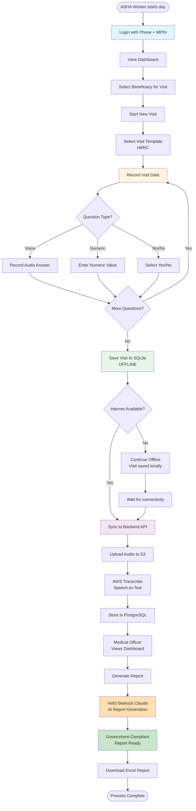
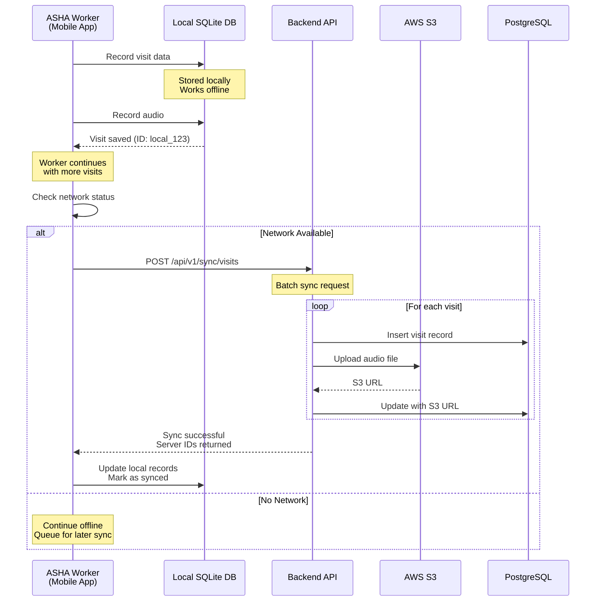
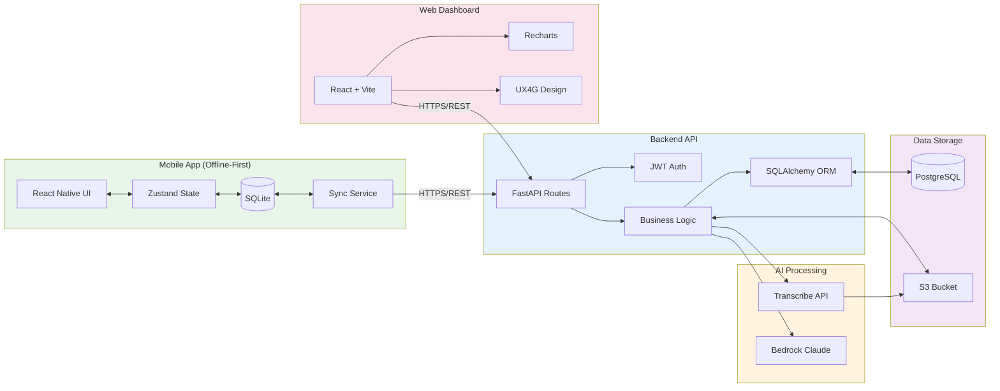
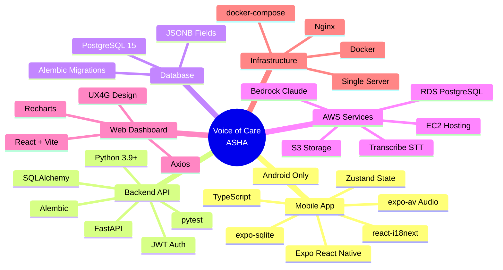
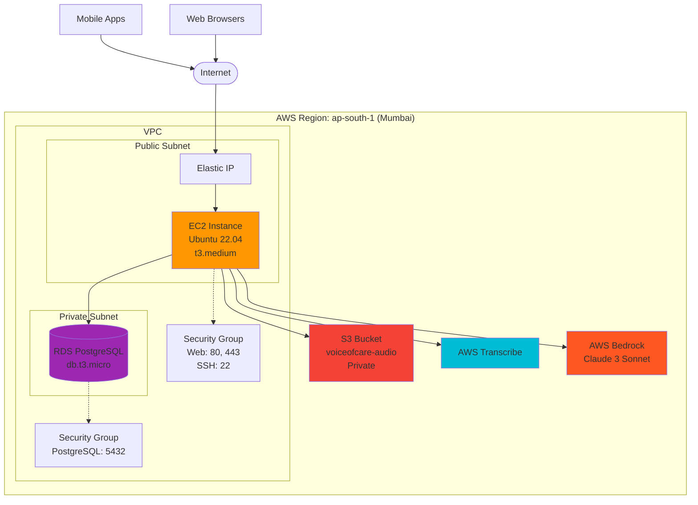

# Voice of Care (ASHA) - Hackathon Diagrams

## 1. Process Flow Diagram

### End-to-End User Journey



### Offline-First Sync Flow



## 2. Architecture Diagram with AWS Services

### System Architecture

```mermaid
graph TB
    subgraph "Mobile Layer"
        Mobile[Mobile App<br/>Expo React Native<br/>Android Only]
        SQLite[(SQLite<br/>Local Database)]
        Mobile <--> SQLite
    end
    
    subgraph "Internet"
        Internet{Internet<br/>Connection}
    end
    
    subgraph "AWS Cloud"
        subgraph "Compute"
            EC2[EC2 Instance<br/>t3.medium]
            Nginx[Nginx<br/>Reverse Proxy]
            Backend[FastAPI Backend<br/>Python 3.9+]
            Web[React Web Dashboard<br/>Vite + UX4G]
        end
        
        subgraph "Storage"
            RDS[(PostgreSQL 15<br/>RDS)]
            S3[S3 Bucket<br/>Audio Files + Reports]
        end
        
        subgraph "AI Services"
            Transcribe[AWS Transcribe<br/>Speech-to-Text]
            Bedrock[AWS Bedrock<br/>Claude 3 Sonnet<br/>Report Generation]
        end
        
        EC2 --> Nginx
        Nginx --> Backend
        Nginx --> Web
        Backend <--> RDS
        Backend <--> S3
        Backend --> Transcribe
        Backend --> Bedrock
        Transcribe --> S3
    end
    
    subgraph "Users"
        ASHA[ASHA Workers<br/>Field Users]
        Officer[Medical Officers<br/>Admin Users]
    end
    
    Mobile <--> Internet
    Internet <--> Nginx
    
    ASHA --> Mobile
    Officer --> Web
    
    style Mobile fill:#4CAF50
    style Backend fill:#2196F3
    style Web fill:#FF9800
    style RDS fill:#9C27B0
    style S3 fill:#F44336
    style Transcribe fill:#00BCD4
    style Bedrock fill:#FF5722
    style EC2 fill:#607D8B
```

### Data Flow Architecture



### Technology Stack Overview



## 3. Deployment Architecture



## Key Features Highlighted

### 1. Offline-First Architecture
- Mobile app works without internet
- SQLite stores all data locally
- Background sync when online
- No data loss

### 2. AI-Powered Reports
- Voice answers transcribed automatically
- Claude AI generates government-compliant reports
- Excel format for easy submission
- Reduces paperwork from hours to minutes

### 3. Scalable Cloud Infrastructure
- AWS managed services
- Auto-scaling capable
- Secure data storage
- Cost-effective for NGO deployment

### 4. User-Friendly Design
- Hindi + English support
- Simple MPIN authentication
- Voice input reduces typing
- Intuitive mobile interface

## Performance Metrics

- **Offline Capability**: 100% functional without internet
- **Sync Time**: < 30 seconds for 10 visits
- **Report Generation**: < 2 minutes per visit
- **Audio Transcription**: Real-time processing
- **Mobile App Size**: < 50 MB
- **Supported Devices**: Android 8.0+

